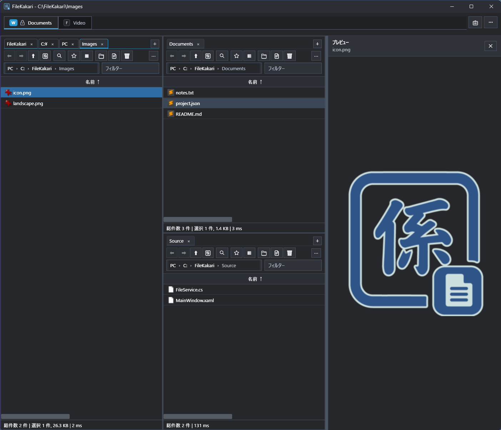
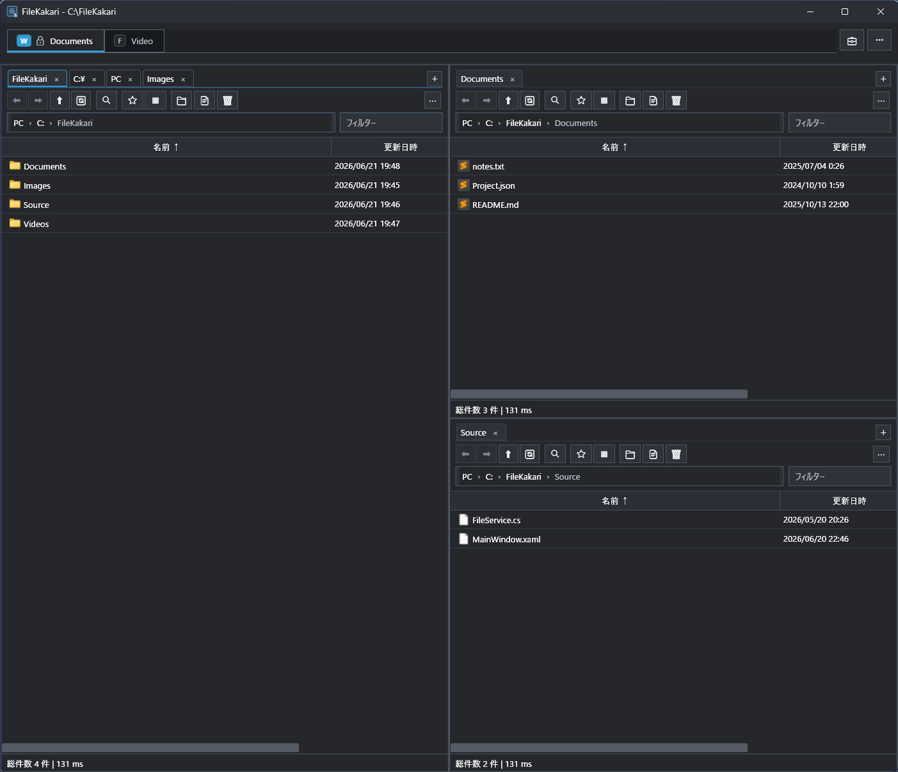
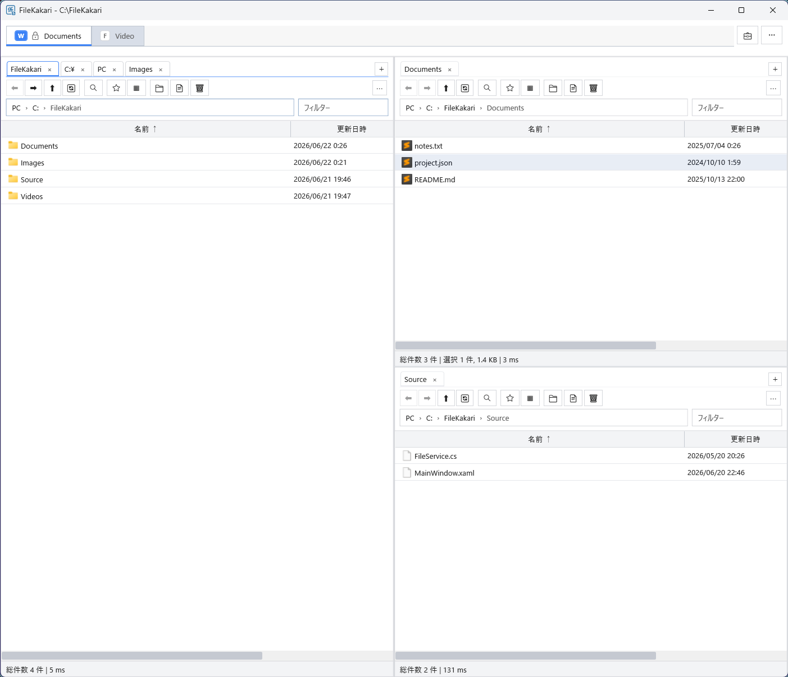

# FileKakari



FileKakariは、通常のフォルダを軽快に扱うWindows向けタブ型ファイラーです。常駐サービスや独自インデックスDBを使わず、必要なときだけ起動します。

> Windows専用です。現在も開発中のため、仕様や保存形式が変わる場合があります。

## 特徴

* 非常駐・非DB
* メインタブ、サブタブ、複数ペイン
* Workspaceによるタブとペイン構成の保存・読み込み
* 仮想化されたファイル一覧と非同期列挙
* ライト、ダーク、カスタムテーマ

<p>
  
  
</p>

## 主な機能

* フォルダ移動、履歴、パス入力、絞り込み
* コピー、移動、貼り付け、リネーム、ゴミ箱への削除、Undo
* ファイルとフォルダのドラッグ＆ドロップ
* 詳細、コンパクト、リスト表示
* 複数選択と矩形選択
* F3によるファイルプレビュー
* User Commandによる外部ツール実行
* Workspaceの保存、読み込み、複数ペイン編集

## 動作環境

* Windows 11
* .NET 10 Desktop Runtime

ソースからビルドする場合は、.NET 10 SDKが必要です。

## ビルド

```
dotnet build FileKakari/FileKakari.csproj
```

実行:

```
dotnet run --project FileKakari/FileKakari.csproj
```

起動時にフォルダを指定することもできます。

```
dotnet run --project FileKakari/FileKakari.csproj -- "C:\Users"
```

## ドキュメント

* [キーボードショートカット](docs/shortcuts.md)
* [User Command](docs/user-command.md)
* [Workspace JSON](docs/workspace-json.md)
* [トラブルシューティング](docs/troubleshooting.md)
* [アーキテクチャ](docs/architecture.md)

## 制限事項

* Windows Explorerの完全互換ではありません。
* Shell名前空間、仮想フォルダ、複雑なShell拡張には対応していません。
* ZIPを通常フォルダとして参照する機能はありません。
* 一部の操作や表示は開発中です。

## 開発について

FileKakariは、生成AIによる設計・実装支援を活用して開発しています。

仕様決定、動作確認、修正方針の判断、公開前の検証は開発者が行っています。

## コミュニティ・貢献

* 貢献方法については、[CONTRIBUTING.md](CONTRIBUTING.md)を参照してください。
* セキュリティ脆弱性の報告については、[SECURITY.md](SECURITY.md)を参照してください。

## ライセンス

[LICENSE](LICENSE)を参照してください。
